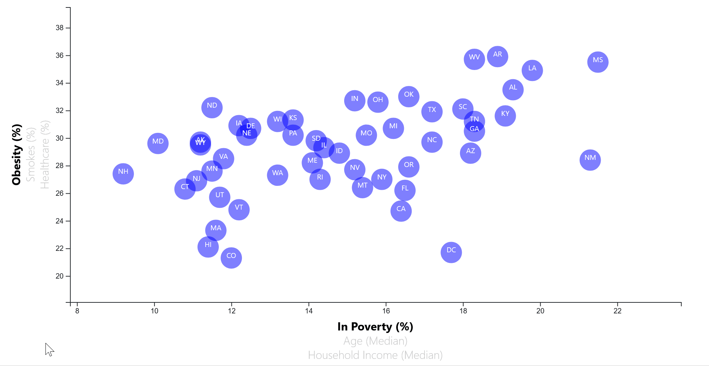
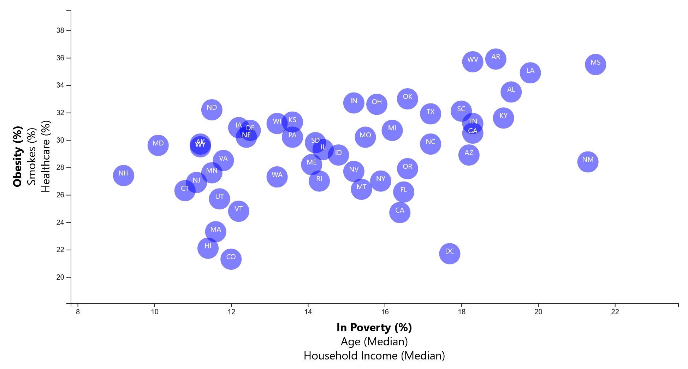
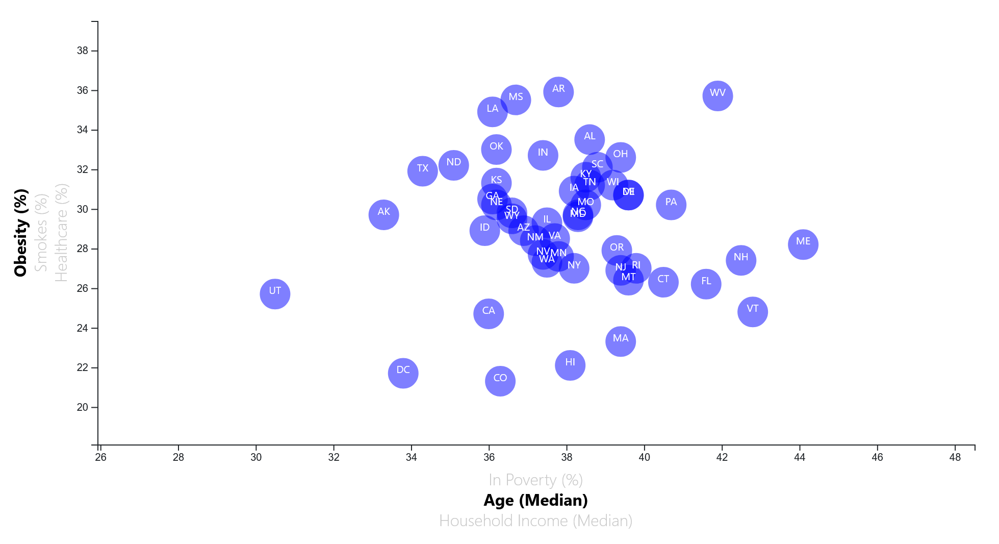

# D3-Challenge
UCSD D3 Challenge

## GitHub Pages Link:
https://sanabuw.github.io/D3-Challenge/D3_data_journalism/index.html

# Project Overview

This repository is for the D3.js assignment for the UCSD Data Bootcamp. The concept of the assignment is to use D3.js to generate a chart that allows for user interaction with transitions. The assignment covers the following concepts:
- Procedurally generating charting elements from tabular data using D3.js
- Using a data source to dynamically change axes scales and data point values
- Attaching event listeners to axes to allow for user-initiated changes to viewing the data
- Applying tool tips to reveal more information from the source data to users

This assignment features a pre-made plugin for the tooltips.
Credit:
Justin Palmer
https://github.com/caged/d3-tip

# Data Walkthrough
The chart above visualizes correlations between various factors of populations centering around health, age and income. Each dot represents a state in the United States, with its position representing the value of the population for that state given the selected field. The labels beside and below the axes can be interacted with to show different relationships.

Of particular note is that both obesity and smoker population percentages seem to have a minor correlation with household income.

There is a significant visual difference when comparing this against visualizations where no correlation can be seen, for example in both obesity and smoker populations against average state age.

# File Overview
All files for the project are included in D3_data_journalism

## index.html
- Main HTML file for the user-end application

## Assets
- Holds all Javascript scripts, style sheets, data and images
